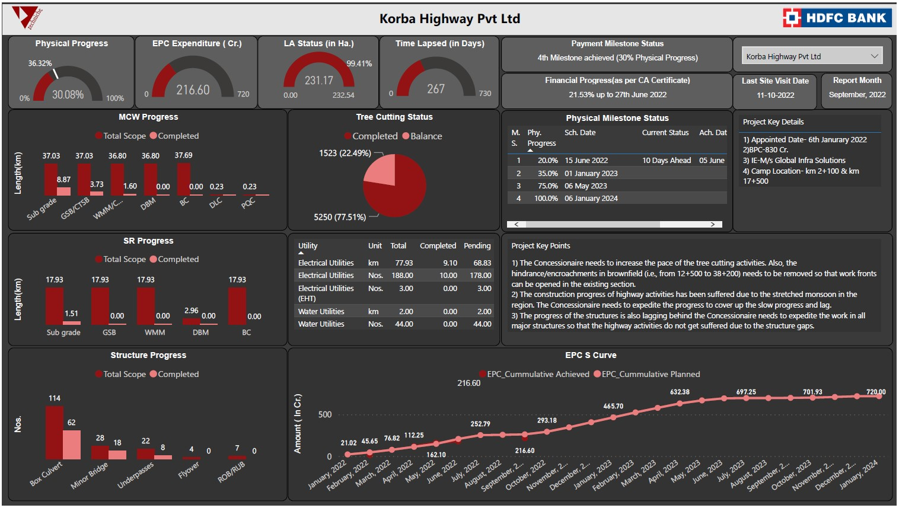

# Data Science Portfolio
##### Akshay Joshi

Below given are a few Projects on which i have worked during the learning phase of my Power BI.

### 1. [Adventure Works Project]
This project is the part of the periodic challange provided by the Maven Analytics.

Here are the Slides of the report for Adventure Works Cycles:

Slide 1: Executive Summary 

Slide 2: Product Details

Slide 3: Customer Details

### 2 . [Construction Progress Dashboard]
This dashboard was developed to monitor the progress of construction projects. It came handy for submitting to client. If same client is having multiple projects then by giving simply one slicer to toggle between the projects.

Here are the Slides of the progress dashboard:

Progress Dashboard

Here you can also find the notes to the related topics. The link will be directed to the Google Drive. You can ask for access to get the notes.

## [Notes/Study Material](https://drive.google.com/drive/folders/1sfkGZk9EaSKAw-gZc7oFvr9qcyzkF-mI?usp=sharing)
The notes are based on various learning sources such as CloudyML, AppliedAI etc.
